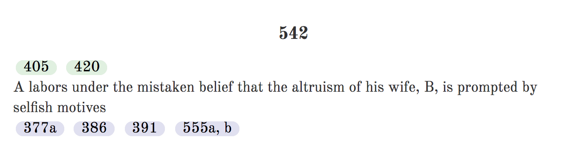
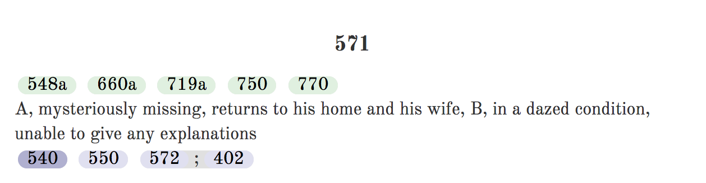
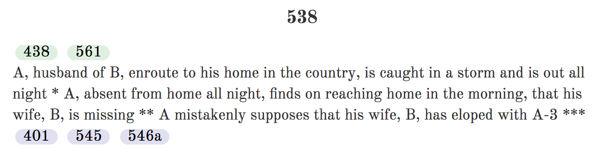
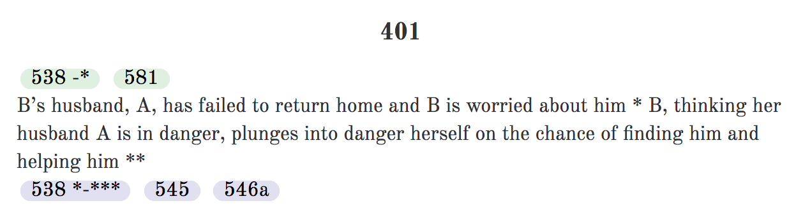
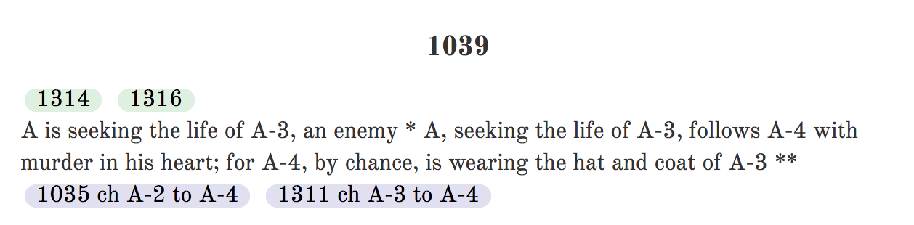

# How to Use Plotto

This document provides a general introduction to how to use Plotto.

## A, B and C Clauses

In Plotto, each Masterplot consists of an "A", "B" and "C" clause.

* The A Clause is the Protagonist Clause.
* The B Clause originates and carries on the action.
* The C Clause carries on and terminates the action.

Generally, you will select one of the [15 "A" clauses](https://garykac.github.io/plotto/plotto-mf.html#a-clauses) to define the starting position for the protagonist, for example, "A Person of Ideals".

Then you select one of the [62 "B" clauses](https://garykac.github.io/plotto/plotto-mf.html#b-clauses) to identify the main action of the story. For example, "Being impelled by an unusual motive to engage in crafty enterprise".

And finally, one of the [15 "C" clauses](https://garykac.github.io/plotto/plotto-mf.html#c-clauses) is selected to specify the ending, for example, "Emerges from a trying ordeal with sorely garnered wisdom".

Once this basic A/B/C framework is complete, the "B" clause can now be expanded by identifying the initial B conflict.

## Initial B Conflict

Once the B clause has been chosen, a suitable conflict can be found that fits that clause.

Plotto provides an [index of conflicts grouped by the "B" clause](https://garykac.github.io/plotto/plotto-mf.html#index-b-clause-conflicts) that can be used as a starting point.

## Expanding B Conflicts

Most of the work with Plotto will be spent fleshing out the details of the initial B conflict. Either by working backward (toward the "A" clause) or forward (toward the "C" clause).

Each conflict has a set of _before_ and _after_ suggestions that can be used to expand upon the base conflict. For example, conflict 542 has 2 **lead-up** suggestions (405 and 420) and 4 **carry-on** suggestions (377a, 386, 391 and 555a,b):

Sometimes multiple suggestions are joined with a `;` to make a **compound** suggestion, as shown here for 571 which has a compound carry-on suggestion of 572 followed by 402.

The text for some conflicts is divided into sections using one or more `*`s. Conflict 538 is divided into 3 sections delimited by `*`, `**` and `***`. 

Links to conflicts may refer to one or more of the sections. Conflict 401 proposes the first section of 538 (from the start up to `*`) as a lead-up suggestion, and the last 2 sections (between the `*` and `***`) as possible carry-on suggestions.

Lead-up and carry-on suggestions may need to change the actors in the linked conflict to match the actors in the current conflict. For example, in conflict 1039 the carry-on suggestions are 1035 (but change A-2 to A-4) and 1311 (but change A-3 to A4).

The following is a list of modifiers that might be found in the suggestion links:

* `ch X to Y` change X to Y
* `tr X and Y` transpose (swap) X and Y
* `add X` add X
* `eliminate X` remove X

Multiple modifiers may be applied to the same suggestion using `&`. 

## The Characters

To simplify descriptions, Plotto always uses the letter `A` for the male protagonist and `B` for the female protagonist.

In addition, various other characters are given abbreviations based on their relationship with `A` or `B`, for example:

* A-2, male friend of A
* A-3, male rival or enemy of A
* F-A, father of A
* M-A, mother of A
* B-2, female friend of B
* B-3, female rival or enemy of B
* BR-B, brother of B
* SR-B, sister of B

A full list of these abbreviations can be found in the [The Plotto Character Symbols](https://garykac.github.io/plotto/plotto-mf.html#character-symbols).
